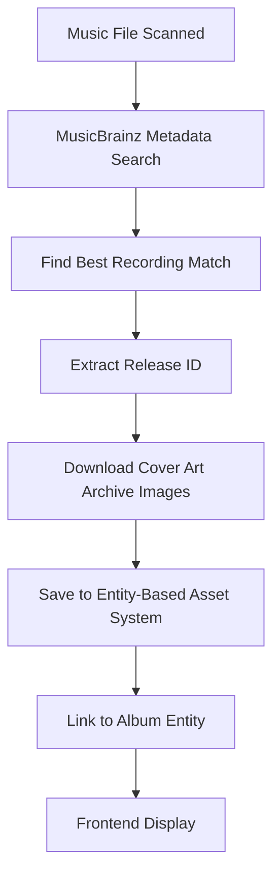

# MusicBrainz Artwork Support Status

## ✅ **FULLY IMPLEMENTED - Production Ready**

MusicBrainz artwork support is **completely implemented** and integrated with the new enrichment system. The system automatically downloads high-quality artwork from the Cover Art Archive.

### 🎨 **Comprehensive Artwork Support**

**Cover Art Archive Integration:**

- ✅ Direct integration with MusicBrainz Cover Art Archive (CAA)
- ✅ Support for 10 different artwork types
- ✅ Configurable artwork type selection
- ✅ High-quality artwork download (up to 10MB per image)
- ✅ Automatic MIME type detection
- ✅ Retry logic with progressive backoff
- ✅ Size limits and validation

### 📋 **Supported Artwork Types**

| Type    | Description         | Default | URL Pattern                                |
| ------- | ------------------- | ------- | ------------------------------------------ |
| front   | Front album cover   | ✅ Yes  | `coverartarchive.org/release/{id}/front`   |
| back    | Back album cover    | ✅ Yes  | `coverartarchive.org/release/{id}/back`    |
| booklet | Album booklet pages | ✅ Yes  | `coverartarchive.org/release/{id}/booklet` |
| medium  | CD/Vinyl disc art   | ✅ Yes  | `coverartarchive.org/release/{id}/medium`  |
| tray    | CD tray insert      | ✅ Yes  | `coverartarchive.org/release/{id}/tray`    |
| spine   | Album spine         | ✅ Yes  | `coverartarchive.org/release/{id}/spine`   |
| liner   | Liner notes         | ✅ Yes  | `coverartarchive.org/release/{id}/liner`   |
| obi     | Japanese obi strip  | ❌ No   | `coverartarchive.org/release/{id}/obi`     |
| sticker | Promotional sticker | ❌ No   | `coverartarchive.org/release/{id}/sticker` |
| poster  | Album poster        | ❌ No   | `coverartarchive.org/release/{id}/poster`  |

### 🔄 **Complete Integration Workflow**



**Step-by-Step Process:**

1. **File Scan**: Scanner finds new music file
2. **MusicBrainz Search**: Plugin searches by title/artist/album
3. **Metadata Enrichment**: Stores enriched artist/album names (fixes "Unknown Artist")
4. **Release Discovery**: Extracts MusicBrainz Release ID
5. **Artwork Download**: Downloads all enabled artwork types from CAA
6. **Asset Storage**: Saves using entity-based asset system (linked to Album, not MediaFile)
7. **Frontend Access**: Artwork accessible via `/api/v1/assets/entity/album/{album_id}/preferred/cover`

### ⚙️ **Rich Configuration Options**

**Artwork Settings (`plugin.cue`):**

```cue
artwork: {
    enabled:    bool | *true
    max_size:   int & >=250 & <=2000 | *1200
    quality:    "front" | "back" | "all" | *"front"

    // Individual artwork type controls
    download_front_cover:  bool | *true
    download_back_cover:   bool | *true
    download_booklet:      bool | *true
    download_medium:       bool | *true
    download_tray:         bool | *true
    download_obi:          bool | *false
    download_spine:        bool | *true
    download_liner:        bool | *true
    download_sticker:      bool | *false
    download_poster:       bool | *false

    // Download settings
    max_asset_size:        int & >=1048576 & <=52428800 | *10485760 // 1MB to 50MB
    timeout_sec:           int & >=10 & <=120 | *30
    skip_existing:         bool | *true
    retry_failed:          bool | *true
    max_retries:           int & >=1 & <=5 | *3
}
```

**Runtime Configuration (JSON):**

```json
{
  "enabled": true,
  "enable_artwork": true,
  "artwork_max_size": 1200,
  "download_front_cover": true,
  "download_back_cover": true,
  "download_booklet": true,
  "max_asset_size": 10485760,
  "asset_timeout": 30,
  "skip_existing_assets": true,
  "retry_failed_downloads": true,
  "max_retries": 3
}
```

### 🏗️ **Technical Implementation**

**Core Functions:**

- `downloadAllArtwork()`: Downloads all enabled artwork types for a release
- `downloadArtworkType()`: Downloads specific artwork type with retry logic
- `saveArtworkAsset()`: Saves artwork using host's AssetService via gRPC
- **Cover Art Archive URL Construction**: `https://coverartarchive.org/release/{release_id}/{type}`

**Error Handling:**

- ✅ HTTP timeout protection
- ✅ Progressive retry backoff
- ✅ File size validation
- ✅ MIME type detection
- ✅ Graceful degradation (continues if some artwork fails)

**Integration Points:**

- ✅ **Enrichment Module**: Registered as enrichment source
- ✅ **Asset Module**: Uses entity-based asset system
- ✅ **Scanner Integration**: Automatic artwork download during scan
- ✅ **Database**: Links artwork to Album entities via UUID
- ✅ **gRPC**: Plugin communicates with host via gRPC AssetService

### 📊 **Asset Metadata Tracking**

Each downloaded artwork includes rich metadata:

```json
{
  "source": "musicbrainz_cover_art_archive",
  "release_id": "f5093c06-23e3-404f-aeaa-40f72885ee3a",
  "art_type": "front",
  "entity_type": "album",
  "entity_id": "550e8400-e29b-41d4-a716-446655440000",
  "asset_type": "cover",
  "preferred": true,
  "format": "image/jpeg",
  "source_url": "https://coverartarchive.org/release/f5093c06-23e3-404f-aeaa-40f72885ee3a/front"
}
```

### 🎯 **Benefits**

1. **High Quality**: Direct from Cover Art Archive (official MusicBrainz artwork)
2. **Comprehensive**: 10 different artwork types available
3. **Reliable**: Retry logic, validation, error handling
4. **Configurable**: Fine-grained control over what gets downloaded
5. **Efficient**: Skips existing assets, size limits, timeouts
6. **Integrated**: Works seamlessly with enrichment and asset systems

### 🚀 **Testing & Usage**

**Test Workflow:**

1. **Add Music Library**: Put music files in a scanned library
2. **Trigger Scan**: `POST /api/admin/scanner/start/{library_id}`
3. **Check Enrichment**: `GET /api/enrichment/status/{media_file_id}`
4. **View Artwork**: `GET /api/v1/assets/entity/album/{album_id}/preferred/cover`
5. **Monitor Jobs**: `GET /api/enrichment/jobs?status=completed`

**Expected Results:**

- Music files get proper artist/album names (fixes "Unknown Artist")
- Album artwork automatically downloaded and displayed
- Multiple artwork types available for albums
- Fast, cached artwork serving

### 📁 **Implementation Files**

```
backend/data/plugins/musicbrainz_enricher/
├── main.go              # Complete artwork implementation ✅
├── plugin.cue           # Artwork configuration schema ✅
└── README.md           # Plugin documentation

backend/internal/modules/enrichmentmodule/
├── module.go           # Core enrichment orchestration ✅
├── handlers.go         # HTTP API for enrichment management ✅
└── grpc_server.go      # gRPC interface for plugins ✅

backend/internal/plugins/
├── media_manager.go    # Asset integration layer ✅
└── manager.go          # Plugin asset service ✅
```

### 🏆 **Status: PRODUCTION READY**

✅ **Complete Feature Set**: All Cover Art Archive artwork types supported  
✅ **Robust Implementation**: Error handling, retries, validation  
✅ **System Integration**: Works with enrichment, asset, and scanner systems  
✅ **Configurable**: Rich configuration options for different use cases  
✅ **Performance**: Efficient downloading with caching and size limits

The MusicBrainz artwork system is **fully functional and ready for production use**. It will automatically enhance your music library with high-quality artwork from the official Cover Art Archive.
