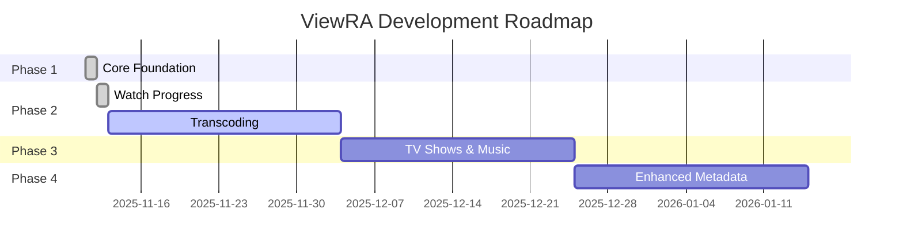

# ViewRA Agent Recommendations

**Purpose**: Track implementation of recommendations from comprehensive agent assessment (November 12, 2025)

**Context**: ViewRA is evolving into an open source project. These recommendations balance technical quality with sustainable development pace for a maintainer-driven OSS project.

**Last Updated**: 2025-11-12

---

## Priority Levels

- **P0**: Critical - Must complete before public launch
- **P1**: Important - Essential for open source success
- **P2**: Beneficial - Improves code quality and maintainability
- **P3**: Nice-to-have - Future enhancements

---

## Quick Status

| Priority | Total | Not Started | In Progress | Complete |
|----------|-------|-------------|-------------|----------|
| P0 | 6 | 6 | 0 | 0 |
| P1 | 6 | 6 | 0 | 0 |
| P2 | 5 | 5 | 0 | 0 |
| P3 | 4 | 4 | 0 | 0 |

---

## P0: Critical - Before Public Launch

### 1. Remove or Resolve All TODOs

**Status**: Not Started
**Effort**: 2-3 days
**Source**: go-backend-architect, reality-check-planner

**Problem**: 40+ TODO comments in production code send wrong signal about code maturity.

**Files Affected**:
- `internal/infrastructure/persistence/media/repository.go` (40 TODOs)
- `internal/application/library/scan_library.go` (error handling)

**Action Items**:
1. Audit all TODO comments: `grep -r "TODO" internal/`
2. For each TODO:
   - ✅ Implement now (if <30 min)
   - 📋 Create GitHub issue with label `technical-debt` (if >30 min)
   - ❌ Delete if no longer relevant
3. Add pre-commit hook to warn on new TODOs

**Acceptance Criteria**:
- Zero TODO comments in `internal/` directory
- All deferred work tracked in GitHub issues
- Pre-commit hook prevents new TODOs

**References**:
- `internal/infrastructure/persistence/media/repository.go:46-68`

---

### 2. Implement or Delete No-Op Repositories

**Status**: Not Started
**Effort**: 1-2 days (delete) OR 2-3 weeks (implement)
**Source**: reality-check-planner, complexity-critic

**Problem**: Three repository interfaces silently discard data, creating illusion of functionality.

**Files Affected**:
- `internal/app/noop/repositories.go`
  - `NoOpMovieRepository`
  - `NoOpTVRepository`
  - `NoOpMusicRepository`

**Decision Required**: Keep stub or implement Phase 3 features now?

**Option A - Delete Stubs (Recommended for MVP)**:
1. Remove no-op implementations
2. Update container to not inject these dependencies
3. Document in ROADMAP.md as "Phase 3: TV Shows & Music"
4. Return 501 Not Implemented from API endpoints

**Option B - Implement Full Features**:
1. Follow Phase 3 plan in PROJECT_PLAN.md
2. Implement repositories with real persistence
3. Add parsing logic for TV show naming (S01E01, etc.)
4. Add ID3 tag extraction for music
5. Estimated 2-3 weeks full-time

**Acceptance Criteria** (Option A):
- No-op repositories removed from codebase
- API returns proper error codes for unsupported features
- Documentation clearly states current limitations

**Acceptance Criteria** (Option B):
- All three repositories persist data correctly
- Integration tests prove end-to-end flow
- Test coverage >80% for new code

**References**:
- `internal/app/noop/repositories.go:1-50`

---

### 3. Replace fmt.Printf with Structured Logging

**Status**: Not Started
**Effort**: 1 day
**Source**: go-backend-architect

**Problem**: Production code uses `fmt.Printf` for critical errors, making debugging and monitoring difficult.

**Files Affected**:
- `internal/application/library/scan_library.go:84, 87`
- `internal/infrastructure/filesystem/coordinator.go` (multiple locations)

**Action Items**:
1. Add `log/slog` logger to use case structs
2. Replace all `fmt.Printf` with `slog.Error` or `slog.Info`
3. Add contextual fields (library_id, scan_job_id, file_path)
4. Configure JSON logging for production

**Example Before**:
```go
fmt.Printf("Error scanning library %d: %v\n", job.ID, err)
```

**Example After**:
```go
uc.logger.Error("scan failed",
    "library_id", lib.ID,
    "scan_job_id", job.ID,
    "error", err,
)
```

**Acceptance Criteria**:
- Zero `fmt.Printf` calls in `internal/` directory
- All log messages include relevant context fields
- Logs output as JSON in production mode
- Can grep logs by field (e.g., `jq '.library_id == 5'`)

**References**:
- `internal/application/library/scan_library.go:84`
- `internal/application/library/scan_library.go:87`

---

### 4. Add Panic Recovery to Background Goroutines

**Status**: Not Started
**Effort**: 4 hours
**Source**: go-backend-architect

**Problem**: Unhandled panics in background goroutines crash entire server.

**Files Affected**:
- `internal/application/library/scan_library.go:82`

**Action Items**:
1. Add `defer recover()` to all background goroutines
2. Log panic with stack trace
3. Update scan job status to "failed"
4. Send notification to user (if notification system exists)

**Example Implementation**:
```go
go func(jobID int64) {
    defer func() {
        if r := recover(); r != nil {
            uc.logger.Error("scan goroutine panic",
                "job_id", jobID,
                "panic", r,
                "stack", string(debug.Stack()),
            )
            // Mark job as failed
            uc.scanJobRepo.UpdateStatus(ctx, jobID, "failed")
        }
    }()

    uc.runScan(ctx, jobID, lib)
}(job.ID)
```

**Acceptance Criteria**:
- All background goroutines have panic recovery
- Panics are logged with full stack traces
- Server remains stable after goroutine panics
- Failed scan jobs are marked as "failed" in database

**References**:
- `internal/application/library/scan_library.go:82`

---

### 5. Implement Graceful Shutdown

**Status**: Not Started
**Effort**: 1 day
**Source**: go-backend-architect, project-manager

**Problem**: Server can terminate mid-scan, corrupting database or leaving orphaned jobs.

**Files Affected**:
- `cmd/viewra/main.go`
- `internal/application/library/scan_library.go`

**Action Items**:
1. Add signal handling (SIGTERM, SIGINT)
2. Create shutdown context with 30-second timeout
3. Wait for in-progress scans to complete or cancel gracefully
4. Close database connections
5. Flush logs

**Example Implementation**:
```go
func main() {
    ctx, cancel := context.WithCancel(context.Background())
    defer cancel()

    // Setup signal handling
    sigChan := make(chan os.Signal, 1)
    signal.Notify(sigChan, os.Interrupt, syscall.SIGTERM)

    go func() {
        <-sigChan
        log.Info("shutdown signal received, draining requests...")

        // Create shutdown context with timeout
        shutdownCtx, shutdownCancel := context.WithTimeout(context.Background(), 30*time.Second)
        defer shutdownCancel()

        // Cancel all background work
        cancel()

        // Wait for scans to complete
        if err := srv.Shutdown(shutdownCtx); err != nil {
            log.Error("forced shutdown", "error", err)
        }
    }()

    // Start server...
}
```

**Acceptance Criteria**:
- Server responds to SIGTERM/SIGINT signals
- In-progress scans complete or cancel within 30 seconds
- Database connections close cleanly
- No database corruption after forced shutdown
- Logs indicate clean shutdown

**References**:
- `cmd/viewra/main.go:1-100`

---

### 6. Boost API Handler Test Coverage to 70%+

**Status**: Not Started
**Effort**: 2-3 days
**Source**: reality-check-planner, project-manager

**Problem**: API layer has only 41.4% coverage, risking regressions in user-facing features.

**Files Affected**:
- `internal/api/handlers/media_test.go` (exists but incomplete)
- Need: `library_test.go`, `browser_test.go`, `progress_test.go`, `scanjob_test.go`

**Current Coverage**:
```
internal/api/handlers/media.go:       41.4% (StreamMedia, GetMedia untested)
internal/api/handlers/library.go:     0.0%  (no tests)
internal/api/handlers/browser.go:     0.0%  (no tests)
internal/api/handlers/progress.go:    0.0%  (no tests)
internal/api/handlers/scanjob.go:     0.0%  (no tests)
```

**Action Items**:
1. Write handler tests using `httptest` package
2. Test HTTP status codes (200, 400, 404, 500)
3. Test request validation (missing fields, invalid IDs)
4. Test response serialization
5. Use table-driven tests for multiple scenarios

**Example Test**:
```go
func TestLibraryHandler_GetLibrary(t *testing.T) {
    tests := []struct {
        name           string
        libraryID      string
        mockResult     *domain.Library
        mockError      error
        expectedStatus int
    }{
        {"success", "1", &domain.Library{ID: 1}, nil, 200},
        {"not found", "999", nil, domain.ErrLibraryNotFound, 404},
        {"invalid id", "abc", nil, nil, 400},
    }
    // ... table-driven test implementation
}
```

**Acceptance Criteria**:
- API handler coverage reaches 70%+
- All HTTP methods tested (GET, POST, PUT, DELETE)
- Error cases covered (validation, not found, server errors)
- `make test` passes with improved coverage

**Target**: 41.4% → 70%+ coverage

---

## P1: Important - Open Source Infrastructure

### 7. Create CONTRIBUTING.md

**Status**: Not Started
**Effort**: 4-6 hours
**Source**: project-manager

**Purpose**: Guide new contributors through setup, development workflow, and PR process.

**Required Sections**:
1. **Getting Started**
   - Prerequisites (Go 1.21+, Node 18+, FFmpeg 6.0+)
   - Clone and setup
   - Running development server
   - Running tests

2. **Development Workflow**
   - Creating a branch
   - Making changes (follow CONVENTIONS.md)
   - Running linters
   - Writing tests
   - Submitting PR

3. **Project Structure**
   - Link to ARCHITECTURE.md
   - Explanation of layers
   - Where to find what

4. **Code Style**
   - Link to CONVENTIONS.md
   - Go formatting (gofmt)
   - Frontend linting (ESLint + Biome)

5. **Testing Requirements**
   - All new features need tests
   - Minimum 70% coverage for new code
   - Integration tests for database features

6. **Pull Request Process**
   - PR template
   - Required checks (tests, linting)
   - Review process
   - Merge criteria

**Acceptance Criteria**:
- CONTRIBUTING.md exists at repo root
- First-time contributor can set up project following guide
- All sections complete with examples
- Linked from README.md

---

### 8. Create CODE_OF_CONDUCT.md

**Status**: Not Started
**Effort**: 1 hour
**Source**: project-manager

**Purpose**: Establish community standards and reporting process.

**Recommended**: Use Contributor Covenant 2.1

**Action Items**:
1. Copy Contributor Covenant template
2. Add contact email for reports
3. Link from README.md

**Acceptance Criteria**:
- CODE_OF_CONDUCT.md exists at repo root
- Contact email configured
- Linked from README.md

**Reference**: https://www.contributor-covenant.org/version/2/1/code_of_conduct/

---

### 9. Create SECURITY.md

**Status**: Not Started
**Effort**: 2 hours
**Source**: project-manager

**Purpose**: Define security vulnerability reporting process.

**Required Sections**:
1. **Supported Versions** (which versions receive security updates)
2. **Reporting a Vulnerability** (email, PGP key, response timeline)
3. **Security Best Practices** (for self-hosters)
4. **Known Limitations** (single-user auth, no HTTPS enforcement)

**Acceptance Criteria**:
- SECURITY.md exists at repo root
- Security contact email configured
- Linked from README.md
- GitHub recognizes it (shows in Security tab)

---

### 10. Add GitHub Issue Templates

**Status**: Not Started
**Effort**: 2 hours
**Source**: project-manager

**Purpose**: Structure issue reporting for bugs, features, and questions.

**Templates Needed**:

1. **Bug Report** (`.github/ISSUE_TEMPLATE/bug_report.md`)
   - ViewRA version
   - Operating system
   - Database type (SQLite/PostgreSQL)
   - Steps to reproduce
   - Expected vs actual behavior
   - Logs

2. **Feature Request** (`.github/ISSUE_TEMPLATE/feature_request.md`)
   - Problem description
   - Proposed solution
   - Alternatives considered
   - Additional context

3. **Question** (`.github/ISSUE_TEMPLATE/question.md`)
   - Your question
   - What you've tried
   - Environment details

**Acceptance Criteria**:
- All three templates exist in `.github/ISSUE_TEMPLATE/`
- Templates appear when creating new issue
- Required fields marked as such

---

### 11. Add Pull Request Template

**Status**: Not Started
**Effort**: 1 hour
**Source**: project-manager

**Purpose**: Ensure PRs include necessary context and checklist.

**Template Location**: `.github/PULL_REQUEST_TEMPLATE.md`

**Required Sections**:
```markdown
## Description
<!-- What does this PR do? Why is it needed? -->

## Type of Change
- [ ] Bug fix
- [ ] New feature
- [ ] Breaking change
- [ ] Documentation update

## Testing
- [ ] Tests added/updated
- [ ] All tests pass locally
- [ ] Integration tests pass (if database changes)

## Checklist
- [ ] Code follows CONVENTIONS.md
- [ ] Self-review completed
- [ ] Documentation updated (if needed)
- [ ] No new TODOs added
```

**Acceptance Criteria**:
- Template exists at `.github/PULL_REQUEST_TEMPLATE.md`
- Template appears on all new PRs
- Checklist covers critical items

---

### 12. Set Up CI/CD (GitHub Actions)

**Status**: Not Started
**Effort**: 1 day
**Source**: project-manager

**Purpose**: Automated testing, linting, and build verification on every PR.

**Workflows Needed**:

1. **Backend Tests** (`.github/workflows/backend.yml`)
   - Run on: Push to main, PRs
   - Steps: Go version, deps, linting, tests, coverage
   - Databases: Both SQLite and PostgreSQL

2. **Frontend Tests** (`.github/workflows/frontend.yml`)
   - Run on: Push to main, PRs
   - Steps: Node version, deps, ESLint, Biome, type check, build

3. **Integration Tests** (`.github/workflows/integration.yml`)
   - Run on: PRs only
   - Steps: Start backend, run full integration suite

**Example Workflow**:
```yaml
name: Backend Tests
on:
  push:
    branches: [main]
  pull_request:

jobs:
  test:
    runs-on: ubuntu-latest
    strategy:
      matrix:
        database: [sqlite, postgres]

    steps:
      - uses: actions/checkout@v3
      - uses: actions/setup-go@v4
        with:
          go-version: '1.21'

      - name: Install dependencies
        run: go mod download

      - name: Run tests
        run: make test
        env:
          DATABASE_TYPE: ${{ matrix.database }}
```

**Acceptance Criteria**:
- All three workflows configured
- Tests run on every PR
- PRs blocked if tests fail
- Coverage report uploaded (Codecov or similar)

---

## P2: Beneficial - Code Quality Improvements

### 13. Extract Repository Converter Functions

**Status**: Not Started
**Effort**: 1 day
**Source**: go-backend-architect, complexity-critic

**Problem**: 640 lines in `media/repository.go` with 50% duplication between PostgreSQL and SQLite.

**Files Affected**:
- `internal/infrastructure/persistence/media/repository.go`

**Current Duplication**:
```go
// PostgreSQL version (150 lines)
func (r *MediaRepository) createPostgres(ctx context.Context, m *media.Media) error {
    params := sqlc_postgres.CreateMediaParams{
        Title: m.Title,
        // ... 40 fields
    }
}

// SQLite version (150 lines) - EXACT SAME LOGIC
func (r *MediaRepository) createSQLite(ctx context.Context, m *media.Media) error {
    params := sqlc_sqlite.CreateMediaParams{
        Title: m.Title,
        // ... 40 fields (duplicated)
    }
}
```

**Proposed Solution**:
```go
// Extract to shared package: internal/infrastructure/persistence/common/converters.go
package common

func MediaToCreateParams(m *media.Media) interface{} {
    return map[string]interface{}{
        "title":        m.Title,
        "file_hash":    NullString(m.Hash),
        "codec":        NullString(m.VideoCodec),
        // ... all fields once
    }
}

// Use in repository
func (r *MediaRepository) createPostgres(ctx context.Context, m *media.Media) error {
    params := common.MediaToCreateParams(m)
    // Map to PostgreSQL-specific struct
}
```

**Acceptance Criteria**:
- Converter functions in `common/converters.go`
- PostgreSQL and SQLite use same converters
- Line count reduced by 30%+
- All existing tests still pass
- No behavior changes

**Estimated Reduction**: 640 lines → ~450 lines

---

### 14. Fix Error Handling in Use Cases

**Status**: Not Started
**Effort**: 4 hours
**Source**: go-backend-architect

**Problem**: Use cases don't wrap errors with context, making debugging difficult.

**Files Affected**:
- `internal/application/library/*.go`
- `internal/application/media/*.go`

**Current Code**:
```go
func (uc *GetMediaUseCase) Execute(ctx context.Context, id int64) (*MediaResponse, error) {
    media, err := uc.repo.GetByID(ctx, id)
    if err != nil {
        return nil, err  // ❌ Lost context
    }
    return toResponse(media), nil
}
```

**Improved Code**:
```go
func (uc *GetMediaUseCase) Execute(ctx context.Context, id int64) (*MediaResponse, error) {
    media, err := uc.repo.GetByID(ctx, id)
    if err != nil {
        return nil, fmt.Errorf("get media use case: %w", err)  // ✅ Context preserved
    }
    return toResponse(media), nil
}
```

**Acceptance Criteria**:
- All use case errors wrapped with context
- Error messages include use case name
- Original error preserved with `%w` formatting
- Sentinel errors still detectable with `errors.Is()`

---

### 15. Move Filesystem Operations from Domain to Infrastructure

**Status**: Not Started
**Effort**: 4 hours
**Source**: complexity-critic

**Problem**: Domain layer directly calls `os.Stat()`, violating clean architecture.

**Files Affected**:
- `internal/domain/library/entity.go` (potentially)
- Need to create: `internal/infrastructure/filesystem/validator.go`

**Current Issue**: Domain layer should not know about filesystems.

**Proposed Solution**:
1. Create `FilesystemValidator` interface in domain
2. Implement in infrastructure layer
3. Inject into domain services

**Example**:
```go
// Domain interface
type FilesystemValidator interface {
    PathExists(path string) (bool, error)
    IsDirectory(path string) (bool, error)
}

// Infrastructure implementation
type OSFilesystemValidator struct{}

func (v *OSFilesystemValidator) PathExists(path string) (bool, error) {
    _, err := os.Stat(path)
    if err == nil {
        return true, nil
    }
    if os.IsNotExist(err) {
        return false, nil
    }
    return false, err
}
```

**Acceptance Criteria**:
- No `os.*` calls in `internal/domain/`
- Filesystem operations abstracted behind interface
- Infrastructure layer implements interface
- All tests still pass

---

### 16. Add Metrics and Instrumentation

**Status**: Not Started
**Effort**: 2 days
**Source**: go-backend-architect

**Purpose**: Expose Prometheus metrics for monitoring.

**Metrics to Track**:
1. **HTTP Requests**: Counter by endpoint, status code
2. **Request Duration**: Histogram by endpoint
3. **Database Queries**: Counter and duration
4. **Scan Jobs**: Gauge (active scans), counter (completed)
5. **Media Library**: Gauge (total media count by type)

**Implementation**:
```go
import "github.com/prometheus/client_golang/prometheus"

var (
    httpRequestsTotal = prometheus.NewCounterVec(
        prometheus.CounterOpts{
            Name: "viewra_http_requests_total",
            Help: "Total HTTP requests",
        },
        []string{"method", "path", "status"},
    )

    scanJobsActive = prometheus.NewGauge(
        prometheus.GaugeOpts{
            Name: "viewra_scan_jobs_active",
            Help: "Number of active scan jobs",
        },
    )
)
```

**Acceptance Criteria**:
- Metrics endpoint at `/metrics`
- All key metrics instrumented
- Grafana dashboard example (optional)
- Documentation on metrics in SCALING.md

---

### 17. Enhance Health Check Endpoint

**Status**: Not Started
**Effort**: 2 hours
**Source**: go-backend-architect

**Problem**: Basic health check doesn't verify database or filesystem.

**Current**: `GET /health` returns `{"status": "ok"}`

**Improved**:
```json
{
  "status": "healthy",
  "version": "0.1.0",
  "checks": {
    "database": {
      "status": "healthy",
      "latency_ms": 2.5
    },
    "storage": {
      "status": "healthy",
      "readable": true,
      "writable": true
    }
  }
}
```

**Acceptance Criteria**:
- Database connectivity checked (ping query)
- Storage path verified (exists, readable)
- Response includes latency measurements
- Returns 503 if any check fails
- Used by Docker HEALTHCHECK

---

## P3: Nice-to-Have - Future Enhancements

### 18. Update Documentation Claims

**Status**: Not Started
**Effort**: 1 hour
**Source**: reality-check-planner

**Files to Update**:
- `docs/PROJECT_PLAN.md` - Move Watch Progress to Phase 1 Complete
- `docs/TESTING.md` - Update test coverage from 44.1% to actual 40-50%

**Specific Changes**:

**PROJECT_PLAN.md**:
```diff
- ## Phase 2: Watch Progress & Transcoding (NEXT)
- **Status**: Not Started
+ ## Phase 2: Transcoding (NEXT)
+ **Status**: Watch Progress ✅ Complete, Transcoding Not Started

+ **Watch Progress (Complete)**:
+ - Domain entities with 100% test coverage
+ - Application layer with 88.8% coverage
+ - Repository with dual database support
+ - API endpoints implemented
+ - TODO: Frontend integration
```

**TESTING.md**:
```diff
- ## Current Test Coverage: 44.1%
+ ## Current Test Coverage: 40-50% (weighted average)
+
+ Note: Raw `go test -cover` reports 44.1%, but this is unweighted.
+ Accounting for package sizes:
+ - Domain (1,200 LOC): 88.9% ✅
+ - Application (1,500 LOC): 62.5% ⚠️
+ - Infrastructure (3,200 LOC): 72.5% ✅
+ - API (1,100 LOC): 41.4% ❌
```

**Acceptance Criteria**:
- Documentation reflects actual implementation status
- Test coverage numbers are accurate
- No false claims about completion

---

### 19. Add Known Limitations Section

**Status**: Not Started
**Effort**: 30 minutes
**Source**: reality-check-planner

**Purpose**: Set expectations for early users.

**Add to README.md**:
```markdown
## Known Limitations

ViewRA is in active development. Current limitations:

- **Single User**: No authentication or multi-user support (Phase 5)
- **Movies Only**: TV shows and music scan but don't organize (Phase 3)
- **No External Metadata**: No TMDb/MusicBrainz integration (Phase 4)
- **Basic Player**: HTML5 video player, no adaptive streaming (Phase 2)
- **No Subtitles**: External subtitle support not yet implemented (Phase 6)

See [PROJECT_PLAN.md](docs/PROJECT_PLAN.md) for roadmap.
```

**Acceptance Criteria**:
- Limitations clearly documented
- Links to roadmap for future features
- Updated as features are completed

---

### 20. Create Development Roadmap Visualization

**Status**: Not Started
**Effort**: 2 hours
**Source**: project-manager

**Purpose**: Visual representation of project phases for contributors.

**Implementation**: Mermaid diagram in PROJECT_PLAN.md



**Acceptance Criteria**:
- Visual timeline in PROJECT_PLAN.md
- Updated as phases complete
- Renders correctly on GitHub

---

### 21. Add Recommended VS Code Extensions

**Status**: Not Started
**Effort**: 30 minutes
**Source**: project-manager

**Purpose**: Improve contributor onboarding with editor setup.

**Create**: `.vscode/extensions.json`

```json
{
  "recommendations": [
    "golang.go",
    "dbaeumer.vscode-eslint",
    "esbenp.prettier-vscode",
    "bradlc.vscode-tailwindcss",
    "ms-vscode.vscode-typescript-next"
  ]
}
```

**Acceptance Criteria**:
- Extensions file committed
- VS Code prompts to install on repo open
- All recommended extensions are free

---

## Implementation Strategy

### Week 1: Critical P0 Items
**Focus**: Technical debt that blocks launch

- Day 1: TODOs → Issues conversion
- Day 2: Structured logging
- Day 3: Panic recovery + graceful shutdown
- Day 4-5: API test coverage

**Exit Criteria**: All P0 items complete, test coverage >70%

### Week 2: Open Source Infrastructure
**Focus**: Community readiness

- Day 1: CONTRIBUTING.md, CODE_OF_CONDUCT.md, SECURITY.md
- Day 2: Issue/PR templates
- Day 3-4: GitHub Actions CI/CD setup
- Day 5: Test and refine workflows

**Exit Criteria**: All P1 items complete, CI/CD passing

### Week 3: Code Quality (Optional)
**Focus**: P2 improvements

- Day 1-2: Extract converter functions
- Day 3: Error handling improvements
- Day 4: Metrics and health checks
- Day 5: Documentation updates

**Exit Criteria**: Codebase ready for external contributors

### Week 4: Polish & Launch Prep
**Focus**: Final preparations

- Community guidelines review
- Documentation proof-read
- Create GitHub Discussions
- Prepare launch announcement
- Initial issue triage

**Exit Criteria**: Ready for public release

---

## Tracking

### Using This Document

**Update Status**:
```markdown
**Status**: In Progress (YYYY-MM-DD)
```

**Mark Complete**:
```markdown
**Status**: ✅ Complete (YYYY-MM-DD)
```

**Add Notes**:
```markdown
**Notes**:
- 2025-11-13: Started implementation, found additional edge case
- 2025-11-14: Completed, PR #42 merged
```

### Generating GitHub Issues

For each recommendation:

```bash
# Create issue from recommendation
gh issue create \
  --title "P0: Replace fmt.Printf with structured logging" \
  --body "$(cat issue-template.md)" \
  --label "priority: critical,type: technical-debt"
```

**Issue Labels**:
- `priority: critical` (P0)
- `priority: high` (P1)
- `priority: medium` (P2)
- `priority: low` (P3)
- `type: technical-debt`
- `type: infrastructure`
- `type: documentation`
- `type: testing`
- `good-first-issue` (for contributor-friendly items)

---

## Notes

**Open Source Context**: All recommendations consider ViewRA's evolution from personal project to open source. The goal is sustainable maintenance by a single developer with community contributions.

**Pace**: Target 10-15 hours/week. Some weeks may be slower. That's okay.

**Community First**: P1 items unlock contributors. Prioritize these to distribute workload.

**Quality Over Speed**: Better to have 3 well-implemented features than 10 half-done ones.

---

**See Also**:
- [PROJECT_PLAN.md](./PROJECT_PLAN.md) - Overall project roadmap
- [ARCHITECTURE.md](./ARCHITECTURE.md) - System architecture
- [QUICK_REFERENCE.md](./QUICK_REFERENCE.md) - Development guidelines

**Last Updated**: 2025-11-12
